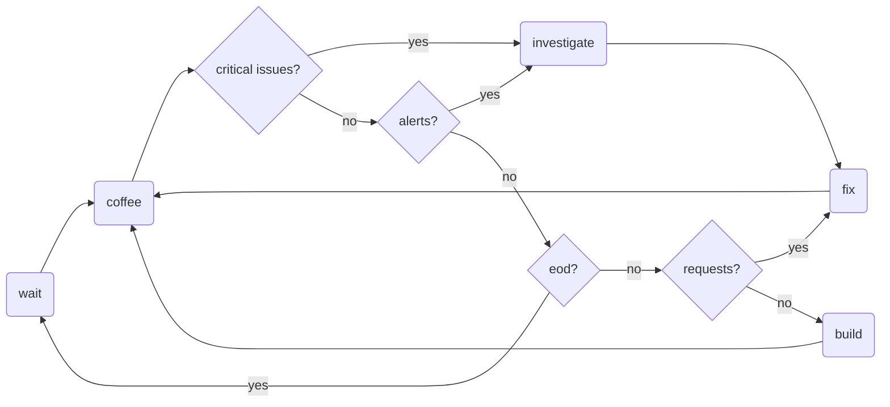

```mermaid

flowchart LR
  s(wait)
  c(coffee)

  d0(investigate)
  d1(fix)
  d2(build)

  if0{critical issues?}
  if1{alerts?}
  if2{requests?}
  ifn{eod?}

  c --> if0
  if0 -- yes --> d0
  if0 -- no --> if1

  if1 -- yes --> d0
  if1 -- no --> ifn

  ifn -- yes --> s
  ifn -- no --> if2

  if2 -- yes --> d1
  if2 -- no --> d2

  s --> c
  d0 --> d1
  d1 --> c
  d2 --> c

```
